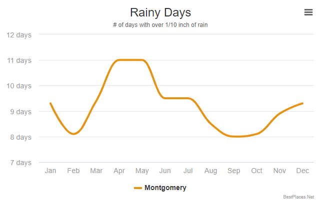
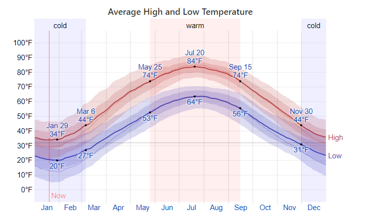

```{r setup, include=TRUE, echo=FALSE}
knitr::opts_chunk$set(message = FALSE, echo= FALSE, warning = FALSE )
```


```{r packages }
# Load packages
library(dplyr) # Data manipulation
library(rio)
library(tidyr) # Data manipulation
library(forecast) # Time series Forecast
library(tseries) # Time series analysis
library(leaflet) # Visualization
library(ggplot2) # Visualization
library(tidyverse)
library(rsample)
library(readr)
library(stringr)
theme_set(theme_bw())
library(knitr) #
library(devtools)
library(purrr)
library(ggpubr)
library(highcharter)
library(dygraphs)
library(xts)  
library(janitor)
library(htmltools)
library(htmlwidgets)
library(reshape2)
library(sarima)


```


```{r}
emrg <- read.csv("911.csv")
```


```{r dpi = 300 , eval=TRUE }

#wordcloud2(df1, size=2,  color='random-dark')


```


## DATASET 


### Overview

* Created by Congress in 2004 as the 911 Implementation and Coordination Office (ICO), the National 911 Program is housed within the National Highway Traffic Safety Administration at the U.S. Department of Transportation and is a joint program with the National Telecommunication and Information Administration in the Department of Commerce.

* Montgomery County, is located in the Commonwealth of Pennsylvania. As of the 2010 census, the population was 799,874 making it the third-most populous county in Pennsylvania.

For more information about dataset : <https://www.kaggle.com/mchirico/montcoalert>


### Variables

**lat**       latitude   

**lng**       longitude

**desc**      Description of location

**zip**       zipcode

**title**     type and subtype of emergency. *i.e EMS : Respiratory emergency*

**timeStamp** time of incident

**twp**       district

**addr**      street name and intersections

**e**         dummy variable (for indexing)


The data consist of 663K emergency 911 calls made in Montegomry County PA from 2015 to 2020 , these calls consist of three types "Traffic, EMS and Fire". 

***Calls are distributed into three types*** 

```{r}
# but first remove unwanted features
#set.seed(123)
#emrg <- sample_n(emrg, 100000)


cleaned_data <- emrg %>% select(-e,  -zip, -desc , -twp )
#write.csv(cleaned_data,"files/for_subtype.csv")


# seperate types to subtypes

#type_subtype <- read_csv("files/type_subtype.csv")


```


```{r distributtion by type, eval=TRUE}
#write.csv(sep_data,"files/type_subtype.csv")

#sep_data2 <- read_csv("files/type_subtype.csv")
#sep_data <- sep_data2 %>% select(-X1)


sep_data <- separate(cleaned_data, col = title, into = c("Type", "SubType"), sep = ":") 
# Simple Horizontal Bar Plot with Added Labels
counts <- table(sep_data$Type)
barplot(counts, main="Distribution per Type", horiz=TRUE,
    names.arg=c("EMS", "Fire", "Traffic"))


```

          
***EMS(emergency medical service) 332692***

***Fire 100622***

***Traffic 230208***

we have 230K traffic accident incident calls between 2015-2020

### Data engineering 

***susbset vehicle accidents calls from traffic calls***

***removing duplicates calls that happened in the same location and same time***

***split type of calls to type and subtype***

***split timestamp to date and time***

***make date as date***

***make numeric characters as integer***

***aggregate the date to have one vale for each date***

***merge data sets from external sources***


```{r, eval=TRUE}

sep_data$date=as.Date(sep_data$timeStamp)
sep_data$date <-substring(sep_data$date,1,10)
rew <- sep_data[grep("VEHICLE", sep_data$SubType), ]
ert <- rew %>% filter(Type == "Traffic")
wer <- ert[- grep("DISABLED", ert$SubType),]
my_data <- wer %>% distinct(lat, date, .keep_all = TRUE)


#counts1 <- table(wer$Type)
#counts1


```


```{r, eval=TRUE}


#knitr::include_graphics('international-data-officers.jpg')


```

 


```{r, eval=TRUE  }

overview <- my_data %>% select(date, Type)
#write.csv(overview,"files/overview.csv")


#ready_d <- separate(overview, col = title, into = c("Type", "SubType"), sep = ":") 
#write.csv(ready_d,"files/ready_d.csv")

# seperate types to subtypes

#ready_d <- read_csv("files/ready_d.csv")

dum_data <- overview %>% mutate(rn = row_number(), n = 1,
         newcol = str_c('var_', `Type`)) %>% 
   pivot_wider(names_from = newcol, values_from = n, values_fill = list(n = 0))

#write.csv(dum_data,"files/dum_data_date.csv")

dum_data$date=as.Date(dum_data$date)

# aggregate dates to sum value for each day  
fixed <- dum_data %>% select(-rn, -Type)


fixed_ts <- aggregate(. ~date, data=fixed, sum, na.rm=TRUE)


#write.csv(fixed_clean,"files/fixed_clean.csv")
#fixed_clean1 <- read.csv("files/fixed_clean.csv")
#fixed_clean <- fixed_clean1 %>% select(-X)
meltdf <- melt(fixed_ts,id="date")
#ggplot(meltdf,aes(x=date,y=value,colour=variable,group=variable)) + geom_line()


```


### Dsitribution of calls during 5 year period


```{r,eval=TRUE}
#fixed_clean <- read_csv("files/fixed_clean.csv")
acc_data <- meltdf %>% select(-variable)
#grab <- acc_data %>% filter(date == "2017-06-15"|date =="2018-06-15")
#percentage <- 

Y <- ts(acc_data[,2],start=c(2015),end=c(2020),frequency = 365)
autoplot(Y) + ggtitle("accidents") + ylab("") 


#knitr::include_url("https://f-fbt.rstudio.cloud/7a8dd5a5ca034dc98a2f176b85632e19/file_show?path=%2Fcloud%2Fproject%2F000013.png")
```
a general overview of the data set 

## Can rain and temprature influence accidents? 


```{r , eval=TRUE}


```


### Rain
 
we will compare the monthly vehicle accidents with the monthly average rainy days  
 

```{r, eval=TRUE }


#acc_data$month=month(acc_data$timeStamp)
#acc_data <- my_data
my_data1 <- acc_data


my_data1$date <-substring(my_data1$date,6,7) 

vvv <-    my_data1 %>% select(date) %>% count(date)
vvv$date <- as.integer(vvv$date)


r <- highchart() %>% hc_title(text="Number of vehicle accidents per month ",style=list(color="red",fontText="Verdana")) %>% hc_xAxis(categories=vvv$date) %>% hc_add_series(name="count of accidents",data=vvv$n) %>% hc_add_theme(hc_theme_google())

r
#saveWidget(r, file= "eachmonthtime series.html")
#knitr::include_url("https://f-fbt.rstudio.cloud/7a8dd5a5ca034dc98a2f176b85632e19/file_show?path=%2Fcloud%2Fproject%2Feachmonthtime+series.html")
```


```{r, eval=TRUE}





```


***is rain and accidents correlated? *** 

we measure correlation

```{r, eval=TRUE}
#mnfreq

rain_days <- data.frame("date" = 1:12, "rainy" = c(8.6,7.6,8.8,10.2,10.3,8.8,9.2,7.9,7.6,7.4,8.4,8.8))


#df <- as.data.frame(lapply(df, rep, df$ntimes))


k <-  merge(vvv,rain_days, by = "date")
lp <- as.data.frame(lapply(k, rep, 5))


log <- log2(k)
ggplot(log, aes(x=n, y=rainy)) + geom_point()  + geom_smooth(method = lm) + ggtitle("cor = 0.70")
cor(k$n, k$rainy)
#[1] 0.700416
```


***The coorelation is 70% *** 

###Temprature

```{r, eval=TRUE}




```


***Can Weather temperature describe accidents? *** 

we measure correlation

```{r , eval=TRUE}

#oneyear  <- acc_data[grep("2017", acc_data$date), ]
oneyear <- acc_data 
oneyear$date <-substring(oneyear$date,6,7)

increase <- aggregate(. ~date, data=oneyear, sum, na.rm=TRUE)
#increase$var_Traffic <- as.integer(increase$var_Traffic)
#increase$date <-as.integer(increase$date)

#perc_inc <- increase%>%
 #   group_by(date) %>%
  #  arrange(date) 
 
temprature <- data.frame("date" = 1:12, "temprature" = c(34, 37, 47, 60, 73, 80, 84, 82, 74, 64, 50, 38 ))

temprature$date <- as.integer(temprature$date)
increase$date <- as.integer(increase$date)


#df <- as.data.frame(lapply(df, rep, df$ntimes))


k <-  merge(temprature,increase, by = "date")


#k$var_Traffic <- log(k$var_Traffic)

ggplot(k, aes(x=value, y=temprature)) + geom_point()  + geom_smooth(method = lm) + ggtitle("cor = -0.51")
#cor(k$temprature, k$value)	


```

***-0.51 is negative 50%, which means they move the opposite way , i.e when weather is warmer accidents are less and vice versa*** 


## Since accidents are correlated with rain and temprature, can we say that rain and temprature are correlated?


we measure correlation

```{r}


k6 <-  merge(temprature,rain_days, by = "date")


#k$var_Traffic <- log(k$var_Traffic)

ggplot(k6, aes(x=rainy, y=temprature)) + geom_point()  + geom_smooth(method = lm) + ggtitle("cor = 0.12")
cor(k6$temprature, k6$rainy)


```


0.1 is very low to tell there is a correlation. 


## which road/interstections has the highest frequency of accidents ?

We picked the top 5 roads/ intersections that have the highest frequency of accidents 

```{r, eval=TRUE}


#cleanedforplot <- my_data %>%
#  select(-e,  -zip, -desc,  )
#seperate types to subtypes
#write.csv(cleanedforplot,"mapplot.csv")

#cal3 <- read_csv("mapplot.csv")
#cal7 <- cal3 %>% select(-X1)
#seperated1 <- separate(cleanedforplot, col = title, into = c("Type", "SubType"), sep = ":") 
#write.csv(seperated1,"seperated1.csv")

#cal3 <- read_csv("seperated1.csv")
#seperated1 <- cal3 %>% select(-X1)

#w <- seperated1 %>% filter(Type == "Traffic") 

q <- my_data %>% count(addr) %>%
  arrange(desc(n)) %>% head(20) 
#sum(q$n)

o <- dplyr::filter(my_data, grepl('SCHUYLKILL EXPY & CONSHOHOCKEN STATE UNDERPASS|BETHLEHEM PIKE & NORTH WALES RD|CHELTENHAM AVE & 79TH AV|GULPH RD & KIRK AVE|RIDGE PIKE & BUTLER PIKE', addr))

l <- o %>%
  leaflet() %>%
 addTiles() %>%
  setView(lng=-75.2, lat=40.1, zoom=10) %>%
  addCircleMarkers(lng = ~lng,
                   lat = ~lat,
                 stroke = FALSE,
                   color = "red",
                   fillOpacity = .75
                  ) %>% addProviderTiles(providers$OpenStreetMap)
l
 
#saveWidget(l, file="mapdrop.html")

#call_map <- leaflet() %>% addTiles() %>% setView(lng=-75.2, lat=40.1, zoom=10) %>%  addMarkers(data=newprod, lng= ~lng, lat= ~lat, clusterOptions = markerClusterOptions())


#l
#knitr::include_url("https://fahad-bt2020.rstudio.cloud/388ac0295e094aeca86a01c80da3dcd9/file_show?path=%2Fcloud%2Fproject%2Fmapdrop.html")
```

## forecast machine learning module ARIMA 


we split the data set into training and testing set, 

train 2015 - 2018

test  2018 - 2020

the reason we are spliting the data is to know fit a module on the period between 2015 - 2018 and forcast 2018 to 2020 , then we  will measure the accuracy of the forecast with the real time series between 2019 - 2020. after measruing the accuracy we will select the best fitting module on the whole data set to forcast 2020 - 2021 .


```{r}
# fot testing 
#set.seed(123)
#emrg <- sample_n(emrg, 5000)

cleaned_data_ts <- my_data %>% select(-addr, -timeStamp , -lat, -lng, -Type)

#cleaned_data_ts <- read_csv("files/for_cleaned_data_ts.csv")
#write.csv(cleaned_data_ts,"files/for_cleaned_data_ts.csv")

# remove hours,mimutes and seconds
cleaned_data_ts$date=as.Date(cleaned_data_ts$date)

#data_ts <- cleaned_data_ts %>% select(-timeStamp)
#write.csv(data_ts,"files/data_ts.csv")
# seperate types to subtypes

#data_ts <- read_csv("files/data_ts.csv")

#type_subtype <- read_csv("files/type_subtype.csv")
#sep_data_ts <- separate(data_ts, col = title, into = c("Type", "SubType"), sep = ":") 
#write.csv(sep_data_ts,"files/sep_data_ts.csv")


### transpose subtype column to 0 and 1 according to timestamp 
#sep_data_ts <- read_csv("files/sep_data_ts.csv")


#cal <- sep_data_ts %>% select(Type,date) %>% filter(Type == "Traffic")
#write.csv(cal,"files/cl_sep_data_ts.csv")

#cal1 <- read_csv("files/cl_sep_data_ts.csv")

#set.seed(123)
#emrg9 <- sample_n(cal1, 100000)

dum_data3 <- cleaned_data_ts %>% mutate(rn = row_number(), n = 1,
         newcol = str_c('var_', `SubType`)) %>% 
   pivot_wider(names_from = newcol, values_from = n, values_fill = list(n = 0))

#write.csv(dum_data,"files/dum_data_ts.csv")


## we remove unwanted columns

fixed <- dum_data3 %>% select(-rn, -SubType)

#write.csv(fixed,"files/dum_data_ts.csv")


# aggregate dates to sum value for each day  


#cal1 <- read_csv("files/cl_sep_data_ts.csv")
#fixed <- cal1 %>%
#  select(-X1, -X1_2)
fixed_ts <- aggregate(. ~date, data=fixed, sum, na.rm=TRUE)
#write.csv(fixed_ts,"files/dum_data_ts.csv")

# now we sum the volume of  calls per day


#finale <- cal %>% mutate(sum = rowSums(.[2:88])) %>% select(sum, everything()) %>% select(date, everything()) %>% select(sum, date)
#write.csv(finale,"files/finale.csv")

#finale1 <- read_csv("files/finale.csv")
#finale <- finale1 %>% select(-X1)


```


```{r, eval=TRUE  }


train <- window(Y, end = 2019)
test <- window(Y, start = 2019, end = 2020)

fit_arima <- auto.arima(train, d=1, D=1, stepwise = FALSE, approximation = FALSE)
fcst <- forecast(fit_arima)
fcstplot <- autoplot(fcst)
autoplot(Y) +
  autolayer(fcst) +
   autolayer(test) +
  xlab("Year") + ylab("Accident calls") +
  ggtitle("Forecasts for 2019-2021 ") +
  guides(colour=guide_legend(title=""))


#saveWidget(fcstplot, file = "fcstplot.png")
#knitr::include_url("https://f-fbt.rstudio.cloud/7a8dd5a5ca034dc98a2f176b85632e19/file_show?path=%2Fcloud%2Fproject%2Ffcrst+plot+trntes.png")

```


### Forecast method

we compare the accuracy of the training and testing set 
```{r, eval=TRUE}
accuracy(fcst, test)
```


```{r, eval=TRUE}
#fcstplot1 <- autoplot(fcst, include=45)
#fcstplot1
#knitr::include_url("https://f-fbt.rstudio.cloud/7a8dd5a5ca034dc98a2f176b85632e19/file_show?path=%2Fcloud%2Fproject%2Ffrcst+train+and+test+comp.PNG")
```

let us remove the trends and smooth the plot  


```{r, eval=TRUE}
print(summary(fcst))
#knitr::include_url("https://fahad-bt2020.rstudio.cloud/388ac0295e094aeca86a01c80da3dcd9/file_show?path=%2Fcloud%2Fproject%2FCapture_summary.PNG")

```

We will use the best module suggested by ARIMA ***ARIMA(4,1,0)(0,1,1)[12]*** 
but it does not look for good and the confidence area is very wide so we add MA = 1 and SMA = 1 to the parameter specifications, Adding both of these terms will yield an "ARIMA(0,1,1)x(0,1,1) model," which is probably the most commonly used ARIMA model for seasonal data


```{r, eval=TRUE}

library(astsa)


#knitr::include_url("https://f-fbt.rstudio.cloud/7a8dd5a5ca034dc98a2f176b85632e19/file_show?path=%2Fcloud%2Fproject%2Fdiff12.png")
```
```{r, eval=TRUE}
sarima(Y,4,1,0,0,1,1,12)
sarima(Y,0,1,1,0,1,1,12)


#knitr::include_url("https://f-fbt.rstudio.cloud/7a8dd5a5ca034dc98a2f176b85632e19/file_show?path=%2Fcloud%2Fproject%2Fbest+module.png")
```

 


```{r, eval=TRUE}
sarima.for(Y, 12, 4,1,0,0,1,1,12)
sarima.for(Y, 12, 0,1,1,0,1,1,12)


#knitr::include_url("https://f-fbt.rstudio.cloud/7a8dd5a5ca034dc98a2f176b85632e19/file_show?path=%2Fcloud%2Fproject%2Ffinal+plot+frcst.PNG")
```

### conclusion 

accident may reach an average of 400 accidents per day, however there is a slight decreasing from 2019 and 2021 in the accidents accorfing to the prediction , so we can conlclude that employment is describing the accidents frequency because all analysis showcased that the increase of employment increased the traffic and the decrease of employement decrease accidents.


### #WORKFROMHOME

```{r pin calls in map, eval=TRUE}

#set.seed(123)
#newprod <- sample_n(emrg, 100000)


#call_map <- leaflet() %>% addTiles() %>% setView(lng=-75.2, lat=40.1, zoom=10) %>%  addMarkers(data=newprod, lng= ~lng, lat= ~lat, clusterOptions = markerClusterOptions())


#knitr::include_url("https://fahad-bt2020.rstudio.cloud/388ac0295e094aeca86a01c80da3dcd9/file_show?path=%2Fcloud%2Fproject%2Ffile1.html")
```


```{r investigating traffic and roads, eval=TRUE}

```


```{r}
#w$hour=hour(w$timeStamp)

#temp = w %>% group_by(hour) %>% summarise(count=n())
#r <- highchart() %>% hc_title(text="TimeSeries of vehicle accidents reports spread over a day",style=list(color="red",fontText="Verdana")) %>% hc_xAxis(categories=temp$hour) %>% hc_add_series(name="count of accidents",data=temp$count) %>% hc_add_theme(hc_theme_google())

#knitr::include_url("https://fahadbt.rstudio.cloud/64b5cead6833425ebc1bdac685ef97c3/file_show?path=%2Fcloud%2Fproject%2Ffile3.html")
```


```{r, eval=TRUE}
#w$month=month(w$timeStamp)

#mnfreq = w %>% group_by(month) %>% summarise(count=n())
#r <- highchart() %>% hc_title(text="TimeSeries of vehicle accidents reports spread over months",style=list(color="red",fontText="Verdana")) %>% hc_xAxis(categories=mnfreq$month) %>% hc_add_series(name="count of accidents",data=mnfreq$count) %>% hc_add_theme(hc_theme_google())

#saveWidget(r, file="avrmonth.html") 

#knitr::include_url("https://fahadbt.rstudio.cloud/64b5cead6833425ebc1bdac685ef97c3/file_show?path=%2Fcloud%2Fproject%2Favrmonth.html")

```


```{r, eval=TRUE}


#library(tidyverse)


#set.seed(123)
#emrg5 <- sample_n(emrg, 5000)

#seperated1 <- separate(emrg5, col = title, into = c("Type", #"SubType"), sep = ":") 


#data <- seperated1 %>%
#   mutate(rn = row_number(), n = 1,
#         newcol = str_c('var_', `SubType`)) %>% 
#   pivot_wider(names_from = newcol, values_from = n, values_fill = #list(n = 0))
  

#data1 = data %>% select(lng, lat, twp, "var_ ASSAULT VICTIM", "var_ #FALL VICTIM","var_ SHOOTING","var_ BURN VICTIM")

#q1 <- data1 %>% count(twp) %>%
#  arrange(desc(n)) %>% head(20)

#o <- dplyr::filter(w, grepl('LOWER MERION|ABINGTON|UPPER #MERION|NORRISTOWN|CHELTENHAM|POTTSTOWN|LOWER PROVIDENCE|UPPER #MORELAND|UPPER DUBLIN|PLYMOUTH', twp))

#lop <- o %>%
#  leaflet() %>%
#  addTiles() %>%
#  setView(lng=-75.2, lat=40.1, zoom=10) %>%
#  addCircleMarkers(lng = ~lng,
#                   lat = ~lat,
#                   stroke = FALSE,
#                   color = "red",
#                   fillOpacity = .75
#                   ) %>% addProviderTiles(providers$OpenStreetMap)
#lop


#saveWidget(lop, file="m.html") 
#knitr::include_url("https://fahad-bt2020.rstudio.cloud/388ac0295e094aeca86a01c80da3dcd9/file_show?path=%2Fcloud%2Fproject%2Fm.html")


```


# Thank you 

